# Gestione Chiamate

Scopri come funzionano le chiamate in **MyCentralino**: effettuale chiamate in uscita, ricevere chiamate in entrata, trasferire conversazioni e gestire tutte le funzionalità avanzate.

## Tipi di chiamate

<CardGroup cols={3}>
  <Card title="📞 Interne" icon="building">
    Tra interni dello stesso centralino
    
    **Caratteristiche:**
    - ✅ Gratuite
    - ✅ Audio HD
    - ✅ Illimitate
  </Card>
  
  <Card title="📲 In uscita" icon="phone-arrow-up-right">
    Verso numeri esterni (clienti, fornitori)
    
    **Destinazioni:**
    - Italia (fisso/mobile)
    - Internazionale
    - Numeri speciali
  </Card>
  
  <Card title="📥 In entrata" icon="phone-arrow-down-left">
    Da clienti verso i tuoi numeri VoIP
    
    **Gestione:**
    - IVR automatico
    - Code
    - Interni diretti
  </Card>
</CardGroup>

## Chiamate tra interni

### Come chiamare un collega

Le chiamate tra interni sono **sempre gratuite** e **illimitate**.

**Da app/softphone:**
1. Componi il numero interno (es. `101`)
2. Premi chiamata
3. Il collega riceve la chiamata su tutti i suoi dispositivi

**Da telefono IP:**
1. Solleva la cornetta
2. Digita il numero interno
3. Premi `#` o attendi 3 secondi

<Tip>
  **Shortcut veloci:**
  
  - `*101` - Chiama interno 101 direttamente
  - `**` - Richiama ultimo numero
  - `*69` - Scopri chi ha chiamato (se persol'ultima chiamata)
</Tip>

### Funzioni durante la chiamata

Durante una chiamata interna puoi:

| Codice | Funzione |
|--------|----------|
| `*1` | Metti in attesa |
| `*2` | Riprendi chiamata |
| `*3` | Trasferisci cieco (blind transfer) |
| `*4` | Trasferisci con consulto |
| `*5` | Registra chiamata (se attivo) |
| `*6` | Inizia conferenza |

### Chiamate di gruppo (Pickup)

Rispondi a chiamate destinate ad altri interni del tuo gruppo:
```
Chiamata in arrivo su interno 102
Tu (interno 101) puoi rispondere digitando: *8102
```

Utile quando un collega è momentaneamente assente dalla scrivania.

## Chiamate in uscita

### Verso numeri italiani

#### Fissi nazionali
```
Numero: 089 123 4567
Formato da digitare: 089123456 oppure 0891234567

Costo: €0.01/minuto
Scatto: Nessuno
```

#### Mobili nazionali
```
Numero: +39 333 123 4567
Formato da digitare: 3331234567 oppure +393331234567

Costo: €0.05/minuto
Scatto: Nessuno
```

<Note>
  Puoi digitare i numeri con o senza prefisso internazionale (+39). Il sistema normalizza automaticamente.
</Note>

### Verso numeri internazionali

#### Formato internazionale
```
Numero USA: +1 555 123 4567
Digita: 001 555 123 4567 oppure +1 555 123 4567

Numero UK: +44 20 1234 5678
Digita: 0044 20 1234 5678 oppure +44 20 1234 5678
```

#### Tariffe principali destinazioni

| Paese | Prefisso | Fisso (€/min) | Mobile (€/min) |
|-------|----------|---------------|----------------|
| 🇫🇷 Francia | +33 | €0.02 | €0.15 |
| 🇩🇪 Germania | +49 | €0.02 | €0.15 |
| 🇬🇧 Regno Unito | +44 | €0.03 | €0.15 |
| 🇪🇸 Spagna | +34 | €0.02 | €0.15 |
| 🇺🇸 USA | +1 | €0.02 | €0.05 |
| 🇨🇳 Cina | +86 | €0.05 | €0.20 |

[Vedi tariffario completo →](https://mycentralino.com/tariffe)

### Prefissi speciali

<Tabs>
  <Tab title="Numeri verdi">
```
    800 XXX XXX - Gratuiti per te
    
    Costo: €0.00
```
    
    I numeri 800 sono gratuiti anche quando chiami tu.
  </Tab>
  
  <Tab title="Numeri premium (BLOCCATI)">
```
    899, 892, 166 - BLOCCATI per policy
    
    ⛔ Non puoi chiamare numeri a pagamento
```
    
    Per protezione, questi numeri sono bloccati di default. Contatta supporto per sblocco caso specifico.
  </Tab>
  
  <Tab title="Numeri brevi">
```
    Emergenze:
    - 112 (Numero unico emergenze)
    - 113 (Polizia)
    - 115 (Vigili del fuoco)
    - 118 (Ambulanza)
    
    Servizi:
    - 114 (Emergenza infanzia)
    - 1515 (Corpo Forestale)
    - 1518 (Viabilità)
```
    
    <Warning>
      I numeri di emergenza potrebbero non funzionare correttamente da VoIP. In caso di vera emergenza, usa un telefono mobile.
    </Warning>
  </Tab>
</Tabs>

### Click-to-call da dashboard

Chiama direttamente dalla dashboard web:

<Steps>
  <Step title="Apri click-to-call">
    Dashboard → Icona telefono in alto a destra
  </Step>
  
  <Step title="Inserisci numero">
    Digita o incolla il numero da chiamare
  </Step>
  
  <Step title="Seleziona interno">
    Scegli da quale interno effettuare la chiamata
  </Step>
  
  <Step title="Chiama">
    Il tuo telefono squillerà, poi verrà chiamato il destinatario
  </Step>
</Steps>

## Chiamate in entrata

### Flusso chiamata standard

```mermaid
graph TD
    A[Cliente chiama 089 123 4567] --> B{Orario apertura?}
    B -->|Sì| C[Riproduce IVR]
    B -->|No| D[Messaggio chiusura]
    C --> E{Scelta cliente}
    E -->|Tasto 1| F[Coda Supporto]
    E -->|Tasto 2| G[Interno Vendite]
    E -->|Timeout| F
    D --> H[Casella vocale]
    F --> I{Operatore disponibile?}
    I -->|Sì| J[Connesso a operatore]
    I -->|No| K[Musica attesa]
    K --> I
```


### Gestione chiamate in arrivo

Quando ricevi una chiamata, vedi:
```
📞 Chiamata in arrivo

Da: +39 333 123 4567
Nome: Mario Rossi (se in rubrica)
Numero chiamato: 089 123 4567
Ora: 14:35

[ RISPONDI ]  [ RIFIUTA ]  [ MANDA SMS ]
```

#### Opzioni risposta

<Tabs>
  <Tab title="Rispondi normalmente">
    Premi pulsante verde o `[Invio]`
    
    La chiamata viene connessa immediatamente.
  </Tab>
  
  <Tab title="Rispondi e metti altre in attesa">
    Se sei già in chiamata:
    
    1. Metti la prima chiamata in attesa
    2. Rispondi alla nuova
    3. Puoi alternare con `*1` e `*2`
  </Tab>
  
  <Tab title="Rifiuta con messaggio">
    Invia automaticamente un SMS:
    
    > "Mi dispiace, al momento non posso rispondere. Ti richiamo appena possibile."
    
    Costo SMS: €0.10
  </Tab>
  
  <Tab title="Devia su casella vocale">
    Manda direttamente in segreteria senza far squillare
  </Tab>
</Tabs>

### ID chiamante

MyCentralino mostra informazioni avanzate:

- 📱 **Numero** con prefisso internazionale
- 👤 **Nome** (se in rubrica o CRM)
- 🏢 **Azienda** (da database pubblico)
- 📍 **Località** (da prefisso)
- 📊 **Storico** (chiamate precedenti)
- ⚠️ **Alert** (spam, blacklist)

<Tip>
  **Integrazione CRM:**
  
  Collega Salesforce, HubSpot o il tuo CRM per vedere automaticamente la scheda cliente quando chiamano.
  
  [Vedi integrazioni →](/mycentralino/crm)
</Tip>

## Funzioni avanzate

### Trasferimento chiamata

#### Trasferimento cieco (Blind Transfer)

Trasferisci senza parlare con il destinatario:

<Steps>
  <Step title="Durante la chiamata">
    Sei in chiamata con il cliente
  </Step>
  
  <Step title="Premi *3">
    Digita `*3` seguito dal numero interno
    
    Esempio: `*3101` (trasferisce a interno 101)
  </Step>
  
  <Step title="Trasferito">
    La chiamata viene immediatamente trasferita
    
    Tu sei scollegato
  </Step>
</Steps>

#### Trasferimento con consulto (Attended Transfer)

Parli prima con il collega:

<Steps>
  <Step title="Metti in attesa">
    Premi `*1` per mettere il cliente in attesa
  </Step>
  
  <Step title="Chiama collega">
    Componi l'interno del collega (es. `101`)
  </Step>
  
  <Step title="Spiega situazione">
    Parli privatamente con il collega
  </Step>
  
  <Step title="Completa trasferimento">
    Premi `*4` per connettere cliente e collega
    
    Oppure riaggancia per tornare al cliente se il collega non può prendere la chiamata
  </Step>
</Steps>

<Tip>
  **Da app smartphone:**
  
  Usa i pulsanti grafici invece dei codici:
  - Bottone "Transfer" → Scegli tipo
  - Bottone "Hold" → Metti in attesa
</Tip>

### Conferenza (chiamata a 3 o più)

Aggiungi più persone alla stessa chiamata:

<Steps>
  <Step title="Durante chiamata">
    Sei in chiamata con persona A
  </Step>
  
  <Step title="Aggiungi partecipante">
    Premi `*6` poi componi numero persona B
  </Step>
  
  <Step title="Parla con B">
    A è in attesa, parli solo con B
  </Step>
  
  <Step title="Unisci">
    Premi `*6` per unire tutti in conferenza
  </Step>
  
  <Step title="Aggiungi altri (opzionale)">
    Ripeti per aggiungere C, D, E...
    
    Massimo: 10 partecipanti
  </Step>
</Steps>

### Pickup di gruppo

Rispondi alle chiamate dei tuoi colleghi:
```yaml
Gruppo: Supporto
Membri: 101, 102, 103

Chiamata arriva su 102 (che è via)
Tu (101) puoi rispondere con: *8102
```

Configurazione gruppi pickup: Dashboard → Interni → Gruppi Pickup

### Do Not Disturb (DND)

Blocca temporaneamente le chiamate in entrata:

<Tabs>
  <Tab title="Da app">
    Attiva "Non disturbare" nel menu
    
    Tutte le chiamate vanno in casella vocale
  </Tab>
  
  <Tab title="Da telefono">
    Digita: `*78` per attivare DND
    Digita: `*79` per disattivare DND
  </Tab>
  
  <Tab title="Da dashboard">
    Stato interno → **Non disturbare** ⛔
  </Tab>
</Tabs>

<Note>
  Con DND attivo, le chiamate interne da interni "VIP" possono comunque passare (configurabile).
</Note>

### Parcheggio chiamata

"Parcheggia" una chiamata e riprendila da un altro dispositivo:
```
1. Durante chiamata, premi *70 (parcheggio)
2. Sistema dice "Chiamata parcheggiata sul 701"
3. Vai a un altro telefono
4. Digita *71701 per riprendere la chiamata
```

Utile quando devi spostarti in un'altra stanza o cambiare dispositivo.

### Registrazione chiamata on-demand

Anche se la registrazione automatica non è attiva:
```
Durante chiamata, premi *5
Sistema: "Registrazione avviata"

Premi *5 di nuovo per fermare
```

File salvato nei CDR con tag "Registrazione manuale".

<Warning>
  Ricorda di informare l'interlocutore se inizi a registrare (obbligo GDPR).
</Warning>

## Qualità audio

### Codec audio supportati

MyCentralino supporta:

| Codec | Bitrate | Qualità | Banda |
|-------|---------|---------|-------|
| **G.722** | 64 kbps | HD (Wideband) | 80 kbps |
| **Opus** | 32-64 kbps | HD (Wideband) | 50-80 kbps |
| **PCMU (G.711)** | 64 kbps | Standard | 80 kbps |
| **PCMA (G.711)** | 64 kbps | Standard | 80 kbps |
| **GSM** | 13 kbps | Bassa | 25 kbps |

<Tip>
  **Per massima qualità:**
  
  1. Abilita G.722 o Opus nell'app
  2. Usa connessione cablata (non WiFi)
  3. Assicurati di avere almeno 100 kbps per direzione
</Tip>

### Risoluzione problemi audio

<AccordionGroup>
  <Accordion title="Audio robotico o spezzato" icon="robot">
    **Causa:** Jitter o packet loss
    
    **Soluzioni:**
    1. Usa connessione cablata
    2. Aumenta jitter buffer (app → impostazioni → 50-100ms)
    3. Abilita QoS sul router per traffico VoIP
    4. Chiudi programmi che usano banda (streaming, torrent)
  </Accordion>
  
  <Accordion title="Eco durante chiamata" icon="wave-pulse">
    **Causa:** Acoustic echo (microfono capta uscita audio)
    
    **Soluzioni:**
    1. Usa cuffie/auricolari con microfono
    2. Abbassa volume altoparlanti
    3. Abilita cancellazione eco (app → avanzate)
    4. Non usare vivavoce in ambienti con eco
  </Accordion>
  
  <Accordion title="Non sento/non mi sentono" icon="volume-xmark">
    **Verifica:**
    1. ✅ Microfono non mutato
    2. ✅ Volume non a zero
    3. ✅ Dispositivo audio corretto selezionato
    4. ✅ Permessi microfono concessi (iOS/Android)
    5. ✅ Codec compatibile negoziato
    
    **Test:** Chiama il numero di test `*43` per verificare microfono
  </Accordion>
</AccordionGroup>

### Test qualità

Chiama il numero di test per verificare:

- `*43` - Echo test (senti la tua voce)
- `*44` - Delay test (verifica latenza)
- `*45` - Music test (qualità audio HD)

## CDR e storico chiamate

### Call Detail Record (CDR)

Ogni chiamata viene registrata con:
```yaml
ID: CDR-20240115-142530-001
Data/Ora: 15/01/2024 14:25:30
Da: +39 333 123 4567
A: 089 123 4567
Interno: 101 (Mario Rossi)
Durata: 00:05:42
Stato: Risposta
Costo: €0.29
Registrazione: [Link download]
Tags: Cliente Premium, Vendita
```

### Accesso CDR

<Tabs>
  <Tab title="Dashboard">
    Dashboard → **Chiamate** → Vedi tutte le chiamate
    
    Filtri disponibili:
    - Per data
    - Per interno
    - Per numero chiamante/chiamato
    - Per durata minima
    - Per stato (risposte/perse)
  </Tab>
  
  <Tab title="Report email">
    Report automatici giornalieri/settimanali via email
    
    Include:
    - Riepilogo chiamate
    - Top 10 numeri più chiamati
    - Chiamate perse
    - Costi totali
  </Tab>
  
  <Tab title="Export">
    Esporta in formati:
    - CSV (Excel)
    - PDF (report stampabile)
    - JSON (per elaborazioni)
    
    Via dashboard o API
  </Tab>
</Tabs>

### Analytics chiamate

<CardGroup cols={2}>
  <Card title="Volume" icon="chart-column">
    - Totale chiamate mese: 1.856
    - Media al giorno: 62
    - Picco giornaliero: 94 (martedì)
    - Crescita vs mese scorso: +12%
  </Card>
  
  <Card title="Performance" icon="gauge-high">
    - Tasso risposta: 94%
    - Tempo medio risposta: 8s
    - Durata media: 5m 23s
    - Abbandoni in coda: 3%
  </Card>
  
  <Card title="Costi" icon="euro-sign">
    - Spesa mese: €187.50
    - Media al giorno: €6.25
    - Chiamata più costosa: €12.30
    - Proiezione fine mese: €195
  </Card>
  
  <Card title="Qualità" icon="star">
    - Chiamate con problemi: 2%
    - Qualità audio media: 4.5/5
    - Packet loss medio: 0.3%
    - Jitter medio: 12ms
  </Card>
</CardGroup>

## Prossimi passi

<CardGroup cols={2}>
  <Card title="Code di chiamata" icon="users" href="/mycentralino/code">
    Distribuisci le chiamate tra più operatori
  </Card>
  
  <Card title="IVR avanzato" icon="sitemap" href="/mycentralino/ivr">
    Crea menu vocali intelligenti
  </Card>
  
  <Card title="Deviazioni" icon="phone-arrow-right" href="/mycentralino/deviazioni">
    Configura deviazioni automatiche
  </Card>
  
  <Card title="API Chiamate" icon="code" href="/mycentralino-api/chiamate/effettua">
    Gestisci chiamate via API
  </Card>
</CardGroup>